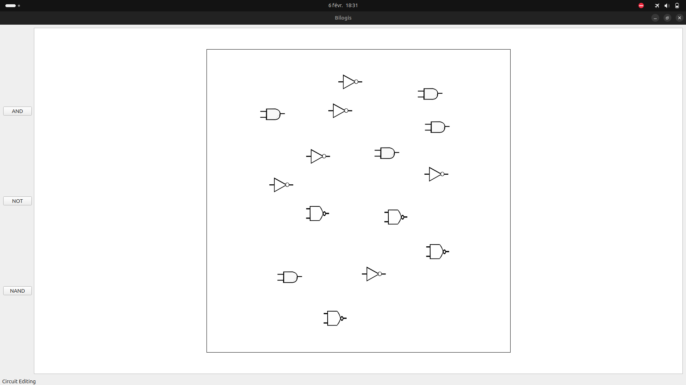
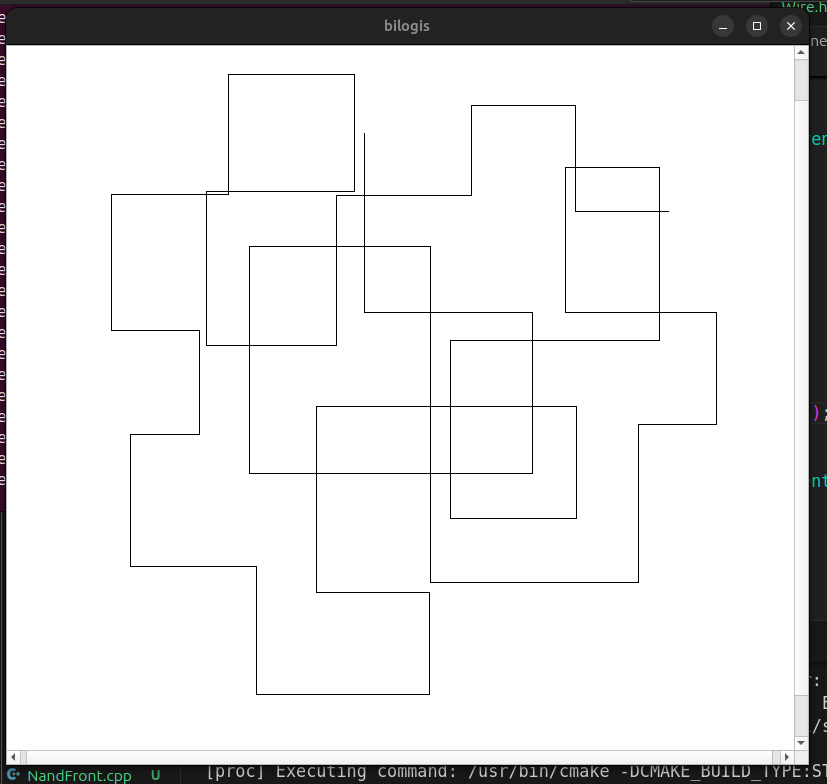
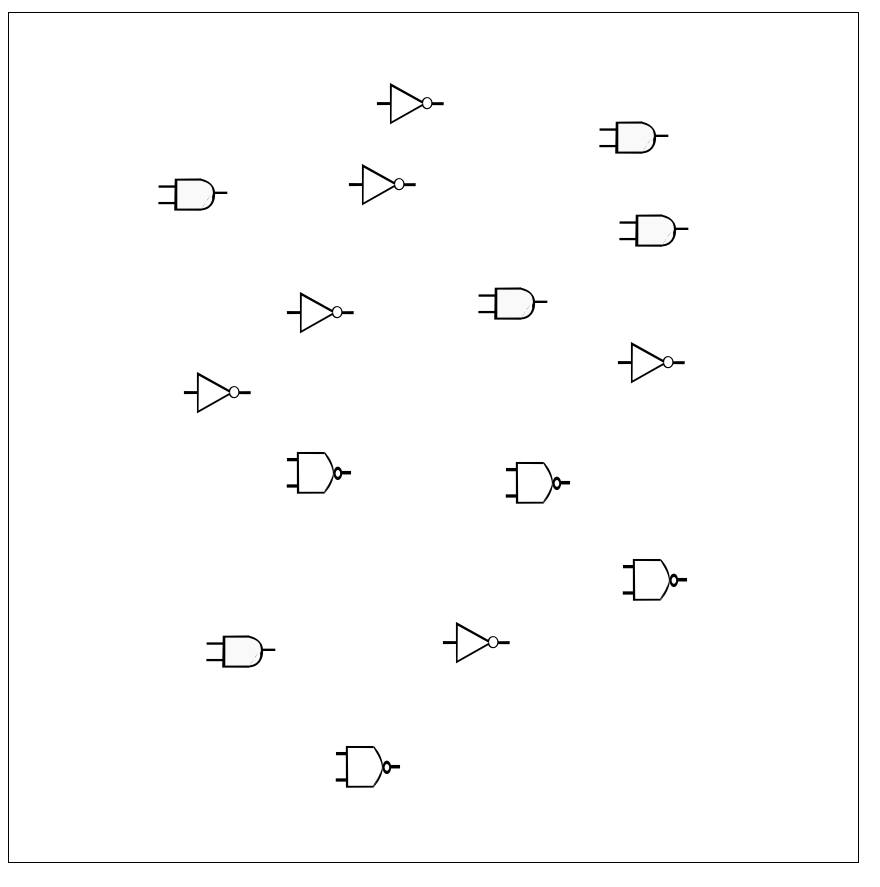

Logic Circuit Simulator

This project is a logic circuit simulator developed in C++, with a pure C++ backend and a Qt-based graphical interface.

📌 Planned Features

Simulation of logic circuits (AND, OR, NOT, XOR gates, etc.)

Intuitive user interface with Qt

Management of component inputs and outputs

Real-time visualization of logic signals

🚀 Installation

📋 Prerequisites

C++ (C++17 or later recommended)

Qt (Qt 5 or Qt 6)

🔧 Build Instructions

Clone the Git repository:

git clone https://github.com/Ferdinaelectro1/Similateur-de-circuit.git
cd Similateur-de-circuit

Compile with qmake and make:

qmake
make

Run the simulator:

./simulateur

🖼️ Screenshots

📜 License

🛠️ Under development – contributions are welcome! 😊